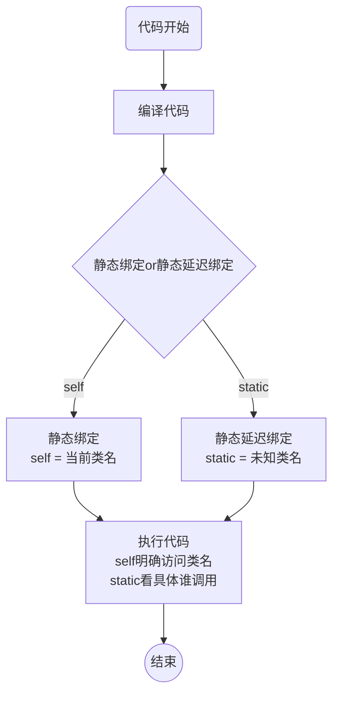

# **面向对象高级**

> 学习目标：了解面向对象的高级特性，掌握PHP中面向对象的高级语法和概念

* 面向对象三大特性
* PHP继承
* 接口
* PHP重载
* trait代码复用
* 对象遍历


## **一、 面向对象三大特性**

> 目标：理解面向对象三大特性，了解每种特性带来的效果和价值

* 封装
* 继承
* 多态


> 概念

**面向对象三大特性**：面向对象是一种编程思想，其本质是以建立模型体现出来的**抽象思维过程**和**面向对象的方法**。模型是用来反映现实世界中事物特征的。

* 面向对象编程思想三大特性：封装、继承、多态
* 三大特性是指导面向对象编程的核心思想


> 小结

1、学习面向对象三大特性的目的是为了更好的理解面向对象编程思想


### **1、封装**

> 目标：理解封装的概念，掌握封装的核心理论，能够运用封装特性来支持面向对象编程


> 概念

**封装**：字面意思就是将内容装到某个容器中，并进行密封保存。在面向对象思想中，封装指将`数据`和对`数据的操作`捆绑到一起，形成对外界的隐蔽，同时对外提供可以操作的`接口`。

* 数据：即要操作的数据，在面向对象的具体体现就是类成员**属性**（属性和静态属性）和类常量，这些都是在类的内部定义的用来保存数据的

* 数据的操作：即数据加工过程，在面向对象的具体体现就是**方法**，内部定义业务逻辑对数据进行加工处理。

* 捆绑到一起：即使用类结构{}将属性、类常量和方法存放到一起，成为一个整体

* 对外提供可操作的接口：即提供可以供外部访问的类成员（通常是**方法**）


> 示例

封装类并使用

```PHP
# 封装特性
class Saler{				# 捆绑内容到一起，形成对外界隐蔽的整体
    const ALLOW = true;
    private static $count = 0;
    private $money = 0;		 # 数据：属性和类常量保存
    
    public function getMoney(){			# 数据操作
        return $this->money;
    }  
}

# 外部
$s = new Saler();
$s->getMoney();				# 外部只能访问类中公有的方法，具体实现不可见
```


> 小结

1、封装是从对象实体抽象形成类的过程

2、封装的目的是让使用者只知道类能做什么，而不知道怎么做的

3、封装特性也明确了类与对象的职责：类负责处理业务逻辑，对象只要调用实现


### **2、继承**

> 目标：理解继承的概念，掌握继承架构带来的效果


> 概念

**继承**：inherit，子类合法拥有父类某些权限

* 继承必须满足继承关系：即存在合理的包含关系
* 继承的本质是子类通过继承可以直接使用父类已经存在的数据和数据操作
* 不同编程语言的继承机制和方式不一样，PHP中使用extends关键字表示继承


> 步骤

1、创建父类：通常是比较抽象的，大概的类，定义的方法和属性也都是比较大众的

2、创建子类

* 子类与已有父类之间属于包含关系：父类包含子类
* 子类创建时明确继承父类：extends

3、实例化子类对象后，子类对象可以直接访问子类不存在而父类存在的属性和方法


> 示例

1、继承的基础：子类（要继承其他类的类，也称之为派生类）与父类（被继承类，也称之为基类）之间本身是一种包含于被包含关系，如此才有可继承的前提

```PHP
# 大类
class Human{}	# 人类
# 小类
class Man{}
class Woman{}	# 属于人类包含的部分，可以继承Human
```

2、继承关键字：extends，子类想要继承父类，则必须在子类结构申明时明确使用extends关键字来继承相关类

```PHP
# 父类
class Human{}	# 人类
# 子类
class Man extends Human{}
class Woman extends Human{}	# 继承Human类
```

3、继承效果：子类可以不用自己去实现某些功能，而可以直接访问父类中已经存在的成员

```PHP
# 父类
class Human{
    public function eat(){
        echo '吃饭';
    }
}
# 子类
class Man extends Human{}			# 子类为空类：没有类成员

# 实例化子类对象
$m = new Man();
$m->eat();							# 输出吃饭
```


> 小结

1、继承extends是面向对象思想中实现代码重复利用的重要特性

2、继承是指子类可以直接访问父类中已经存在的成员

3、继承可以节省代码工作，同时允许子类中进行扩展，即在子类中增加必要的父类不存在的功能


### **3、多态**

> 目标：了解多态的概念，理解多态的作用


> 概念

**多态**：多态性是指相同的操作或函数、过程可作用于多种类型的对象上并获得不同的结果

* 需要发生**类的继承**，同时出现**方法的重写（override）**，即子类拥有与父类同名的方法
* 在实例化对象的时候让父类对象指向子类对象（强制类型，PHP不支持）
* 结果：父类对象表现的子类对象的特点


> 步骤

1、明确继承关系：子类继承父类

2、子类重写父类方法

3、实例化子类，但是存储子类对象的数据类型为父类对象

4、实现：父类对象表现出子类对象的形态


> 示例

1、多态需要强类型语言，以Java为例

```java
// 父类
class Animal{
    public void show(){
         System.out.println("Animal");
    }
}

// 子类
class Dog extends Animal{
    // 重写show方法
    public void show(){
         System.out.println("Dog");
    }
}

// 实例化：Java是强类型，必须指定保存数据的变量的类型
Animal a = new Doc();	 // 父类对象指向子类对象空间：a为父类形态
a.show();				 // 打印Dog，父类对象调用的是子类方法：a表现出子类形态
```

2、PHP是弱类型语言，所以不存在变量的强制类型，因此PHP不支持多态。但是PHP可以模拟多态

* 多种子类继承父类
* 子类重写父类方法
* 父类定义方法实现统一重写方法调用

```php
# 父类
class Animal{
	# 统一调用被重写方法
	public static function show(Animal $obj){	
        # Animal $obj，强制对象为Animal对象（子类对象也可以）
		# 对象动态调用方法
		$obj->display();
	}

    # 父类方法
	public function display(){
		echo 'Animal';
	}
}

# 子类1
class Cat extends Animal{
    # 重写父类方法
	public function display(){
		echo 'cat';
	}
}

# 子类2
class Dog extends Animal{
	public function display(){
		echo 'dog';
	}
}

# 父类方法统一调用：传入不同的对象
Animal::show(new Cat());		# 输出cat
Animal::show(new Dog());		# 输出dog
```


> 小结

1、多态的发生必须是有继承关系，并且子类要重写父类方法

2、多态是指父类对象拥有子类形态，并且可以表现出子类的特性（调用子类方法）

3、PHP是弱类型语言，不支持多态


## **二、 PHP继承**

> 学习目标：掌握PHP中继承的实现，理解PHP继承中的诸多特性，能够使用继承来实现大型项目架构

- 继承语法
- 重写
- parent关键字
- PHP继承特点
- 静态延迟绑定
- 最终类
- 抽象类


### **1、继承相关概念和实现**

> 目标：了解PHP继承中相关的关键字，实现PHP中的继承


> **概念**

**继承**：extends，是指子类通过继承可以**访问父类的成员**

* 父类：也叫基类，是较大的分类
* 子类：也叫派生类，比父类的分类要小


> 步骤

1、根据需求先抽象出父类

2、根据需求确定子类，并实现继承


> 示例

1、继承基本语法：class 子类 extends 父类{}

```PHP
# 父类（基类）：人类是较大类，所有人都属于人类
class Human{}

# 子类（派生类）：小于人类，并且输入人类
class Man extends Human{}
```

2、继承效果：父类被继承的内容，可以通过子类对象进行访问（只能是子类对象）

```PHP
# 父类（基类）
class Human{
    public function showName(){
        echo __CLASS__;		# 代表当前所在类名
    }
}

# 子类（派生类）
class Man extends Human{}

# 实例化子类对象：如果实例化父类对象Human，那么与子类和继承毫无关系
$m = new Man();
$m->showName();				# 访问继承自父类的方法：输出Human
```

3、继承目标：继承本质是针对同类有包含关系的共性继承，即父类通常是包含子类，子类属于父类。所以在父类中通常定义的是子类共有的一些特性成员，这是开发者默认遵循的规则

```PHP
class Animal{}
class Man extends Animal{}		# 不会有语法错误，也可以继承，但是不符合实际
```


> 小结

1、继承是利用extends进行子类和父类的关联

2、继承利用extends关键字实现

3、继承是指实现继承关系后，子类对象可以访问父类被继承的成员。而父类对象（直接实例化父类得到）不可以访问子类成员（没有关系）


### **2、有限继承**

> 目标：理解PHP中继承的内容，掌握继承架构中的设计方案实现继承


> 概念

**有限继承**：指子类在继承父类的成员的时候，并非继承所有内容，而是继承并使用父类部分内容

* PHP中继承的本质是对象继承
* PHP中继承的内容：父类所有公有成员、受保护成员和私有属性，私有方法不能继承
* 受保护（protected）成员是专用于继承的，可以在父类或者子类内部访问
* 私有成员的访问只能在所属类中设定公有或者受保护方法实现访问
* 静态成员也遵循继承规则：即子类可以访问父类静态成员（满足继承条件下）


> 示例

1、继承内容：PHP中继承是子类继承父类所有的公有成员、受保护成员和私有属性，不能继承父类的私有方法

```PHP
# 父类
class Human{
    const CALL = '人';
    public $name = 'human';
    protected $age = '100';
    private $money = '100';
    
    public function showName(){
        echo $this->name;
    }
    
    protected function showAge(){
        echo $this->age;
    }
    
    private function showMoney(){
        echo $this->money;
    }
}

# 子类
class Man extends Human{}
# 实例化子类
$m = new Man();
var_dump($m);				# 可以看到父类私有属性：说明被继承
$m->showName();				# 允许直接访问：方法为公有允许类外访问
```

2、受保护继承protected，protected关键字的产生本身就是纯用于继承的，表示允许被子类在子类内部访问的意思，而不允许被外部直接访问。

```PHP
# 父类
class Human{
    protected $age = '100';
    protected function showAge(){
        echo $this->age;
    }
}

# 子类
class Man extends Human{
    # 在子类内部增加公有访问访问继承自父类的受保护成员
    public function getProtected(){
        echo $this->age;				# 访问父类受保护属性
        $this->showAge();				# 访问父类受保护方法
    }
}

# 实例化子类对象
$m = new Man();
$m->getProtected();						# 正确输出：说明可以访问
```

3、访问父类私有成员：子类若想访问父类私有成员，那么前提是父类提供了能够访问私有成员的接口：即提供了公有或者受保护的方法给子类访问

```PHP
# 父类
class Human{
    private $age = 100;
    private $money = 100;
    # 提供接口供子类访问：此时通常是受保护的方法，肯定不允许外部直接访问的
    protected function getAge(){
        echo $this->age;
    }
}

# 子类
class Man extends Human{
    # 依然需要定义方法来访问继承自父类的受保护的成员
    public function showPrivate(){
        $this->getAge();
    }
}

# 实例化子类对象
$m = new Man();
$m->showPrivate();		# 输出100，表示正确访问
```

**注意**：虽然子类可以通过以上方式来实现访问父类的私有成员（包括私有方法），但是从设计的意义上讲，私有就是不允许外部访问，所以父类通常不会提供对外的访问接口，以上案例只是为了知识说明。

4、静态成员（类常量）也遵循继承规则（PHP继承本质是对象），只是访问方式是由类进行访问

```PHP
class Human{
    const NAME = '人';
    public static $count = 0;
    protected static $type = array('黑','黄','白');
    
    public static function getCount(){
        echo self::NAME;
        echo self::$count;
    }
    protected static function getType(){
        print_r(self::$type);
    }
}

class Man extends Human{
    # 依然需要子类中访问受保护成员
    public static function getHuman(){
        Human::getType();
    }
}

echo Man::$count;	# 允许直接访问
Man::getCount();	# 访问父类静态方法
Man::getHuman();	# 利用子类公有方法访问父类受保护成员
```

5、构造方法和析构方法也可以被子类继承，此时需要注意子类对象实例化时对应的父类构造方法的参数

```PHP
# 父类
class Human{
    private $money;
    public function __construct($money){
        $this->money = $money;
    }
    
    public function __destruct(){
        echo 'die';
    }
}

# 子类继承
class Man extends Human{}

# 子类实例化：自身是空类，没有指定构造方法
# $m = new Man();					# 错误：缺少参数，因为会自动调用父类构造方法
$m = new Man(100);					# 正确
```


> 小结

1、继承是有限继承，理论上是用来继承父类允许被继承的部分，即使用public或者protected修饰的成员（有限继承指的是有限能用而已）

2、因为对象的属性是保存在对象内存空间，所以父类的私有属性也会继承

3、父类私有成员本质不允许被子类访问，但是可以通过父类开放接口实现（一般不会这么操作）

4、静态成员也可以遵循继承规则

5、构造方法也可以被继承，因此在实例化子类对象的时候，要考虑到父类构造方法所使用到的参数问题


### **3、重写Override**

> 目标：理解重写的概念，掌握重写的意义


> 概念

**重写**：override，子类中定义了与父类重名的成员

* 子类可以重写父类任意类成员
  * 属性：直接覆盖，父类对象的属性将不存在（私有除外）
  * 方法：同时存在
* 通常重写是用来重写父类的方法，用于扩展或者更改某些业务逻辑
* 重写要求
  * 子类对于成员的控制权不能高于父类
  * 子类重写方法时，参数要求与父类一致


> 步骤

1、存在继承关系

2、父类存在方法，但是不满足子类业务要求

3、子类重写父类方法（或者属性）


> 示例

1、子类继承父类，同时子类定义与父类同名的类成员

```PHP
# 父类
class Human{
    public $name = 'Human';
    public function show(){
        echo __CLASS__,'<br/>';
    }
}

# 子类继承
class Man extends Human{
    # 定义同名属性
    public $name = 'Man';
    # 定义父类同名方法
    public function show(){
        echo __CLASS__,' hello world<br/>';
    }
}
```

2、重写父类成员之后，子类只会直接访问子类的成员（覆盖）

```PHP
# 接上述代码
# 实例化子类对象
$m = new Man();
$m->show();				# 输出Human hello world
var_dump($m);			# 只有子类属性$name
```

**注意**：不管是公有和是受保护属性，一旦重写，父类的就会不存在，而私有属性不会被覆盖而丢失

3、重写的要求1：子类重写父类的方法，控制权不能高于父类，即子类可以比父类更开放

```PHP
# 父类
class Human{
    protected function show(){
        echo __CLASS__,'<br/>';
    }
}

# 子类继承
class Man extends Human{
    # 重写
    protected function show(){}				# 正确
    public function show(){}				# 允许
    private function show(){}				# 错误：控制权比父类更严格  
}
```

4、重写的要求2：PHP中重写要求子类重写父类方法的时候，必须保证与父类同名方法参数一致

```PHP
# 父类
class Human{
    protected function show(){
        echo __CLASS__,'<br/>';
    }
}

# 子类继承
class Man extends Human{
    # 重写
    public function show(){}
    public function show($a){}			# 错误，与父类同名方法不一致
}
```

**注意**：在方法参数一致不单单要求数量一致，而且数据类型要求也必须相同，但形参名字可以不同；另外，在PHP7以前重写对于参数这块没有要求。

5、重写的要求3：重写针对的是被继承的成员，父类私有方法不会被继承，因此不受要求2规定

```PHP
# 父类
class Human{
    private function show(){
        echo __CLASS__,'<br/>';
    }
}

# 子类
class Man extends Human{
    private function show($name){		# 不会报错，因为本质不存在重写（父类Human::show没有被继承）
        echo $name,'<br/>';
    }
}
```


> 小结

1、重写override是一种在子类中定义父类同名成员的操作

2、公有、受保护的属性重写是直接覆盖父类成员，私有属性不会被覆盖；公有、收保护的方法会被重写，但是私有方法不会被重写（私有方法本质没有被继承）

3、重写的要求

* 子类控制权不能高于父类控制权
* PHP7中要求被重写的方法必须与父类保持参数一致（数量和类型）
* 私有方法不能继承，因此不存在重写

4、静态成员也可以被重写，但是静态属性不会被覆盖（属于类，不属于对象）


### 4、parent关键字

> 目标：理解重写后的访问原理，使用parent实现被重写后的父类成员访问


> 概念

**parent关键字**：一种明确访问父类成员的表达方式

* parent关键字是用于在被重写的方法（子类）中明确访问父类被重写成员
* parent可以访问父类静态属性、静态方法、类常量和普通方法
* parent使用范围解析操作符访问

```php
parent::父类方法()
```


> 步骤

1、子类继承父类

2、子类重写父类方法

3、子类重写的方法内部需要访问父类成员或者明确需要访问父类成员

4、使用parent访问父类方法


> 示例

1、父类为数据库初始化类，子类为针对表的业务类：子类继承父类，但是子类也有资源要初始化，需要重写父类构造方法：但是又需要父类的构造方法执行以实现数据库的初始化操作

```php
class DB{
    protected $link;
    
    public function __construct(){
        $this->link = mysqli_connect('localhost','root','root','db_2','3306') or die('数据库连接失败！');
        
        echo __METHOD__;
    }
}

class Table extends DB{
    # 重写父类方法
    public function __construct(){
        # 让父类构造方法先执行
        parent::__construct();
        
        # 执行其他
        echo __METHOD__;
    }
}

# 实例化
$t = new Table();		# 输出DB::__construct Table::__construct
```

2、静态属性重写后，需要在子类中进行访问

```php
class Father{
    public static $count = 1;
}

class Son extends Father{
    # 重写
    public static $count = 2;
    
    public static function getCount(){
        echo self::$count + parent::$count;
    }
}
# 调用
Son::getCount();
```


> 小结

1、方法被重写后，访问调用的都是子类方法，如果想要访问父类方法，可以通过在子类方法中使用parent关键字来强制访问父类方法

2、parent不能用于访问父类的属性（静态属性可以）


### **5、PHP继承特点**

> 目标：了解PHP继承的特性，避免在使用继承过程中出现问题


> 概念

**PHP继承特点**：与其他纯面向对象（从设计之初就完全由面向对象思维支配）编程语言是有一些不一样

* PHP只能单继承，只有一个父类
* PHP继承中，只有私有方法不能继承
* PHP允许继承父类中的构造方法和析构方法


> 示例

1、PHP中继承只能单继承：即子类只有一个父类（有些语言支持多继承）

```PHP
class Man{}
class Woman{}
class Ladyboy extends Man,Woman{}	# PHP中错误，不允许继承多个父类
```

2、PHP若想继承多个类，可以使用链式继承

```PHP
class Man{}
class Woman extends Man{}
class Ladyboy extends Woman{}		# Ladyboy包含了Man和Woman类中所有可继承的成员
```


> 小结

1、PHP中的继承与传统的面向对象继承有着一些小区别，大家在使用继承的时候要严格遵守PHP的继承规则


### **6、静态延迟绑定**

> 目标：了解静态延迟绑定的原理，掌握静态延迟绑定的应用


> 概念

**静态延迟绑定**：static，即在类内部用来代表类本身的关键字部分不是在类编译时固定好，而是当方法被访问时动态的选择来访者所属的类

* 静态延迟绑定就是利用`static`关键字代替静态绑定self（静态绑定），静态延迟绑定需要使用到静态成员的重写
* 静态延迟绑定是为了明确访问的主体：类


> 步骤

1、要访问的内容为静态成员（或者类常量）

2、需要动态确定访问者而不是固定死

3、使用静态延迟绑定


> 示例

1、静态延迟绑定：使用static关键字代替self进行类成员访问

```PHP
# 父类
class Human{
    public static $name = 'Human';
    public static function showName(){
        # 静态绑定
        echo self::$name,'<br/>';
        # 静态延迟绑定
        echo static::$name,'<br/>';
    }
}

Human::showName();					# 输出Human和Human（此时没子类的事儿）
```

2、静态延迟绑定一定是通过继承后的子类来进行访问才有效果

```PHP
# 子类
class Man extends Human{
    # 重写父类静态属性
    public static $name = 'Man';	# 静态属性因为存储在类内部，因此不会覆盖
}

# 子类访问
Man::showName();					# 输出Human和Man
```


> 原理




> 小结

1、静态延迟绑定是指通过static关键字进行类静态成员的访问，是指在被访问时才决定到底使用哪个类

2、静态延迟绑定对比的是静态绑定self

3、静态延迟绑定的意义是用来保证访问的静态成员是根据调用类的不同而选择不同的表现


### **7、最终类Final**

> 目标：了解最终类的概念，掌握final关键字的作用和实际应用场景


> 概念

**最终类**：使用final关键字修饰类名，表示此类不可以被继承

* 最终类表示类已经到头，不允许再作为其他类的父类被继承
* 最终类只能直接实例化使用
* final除了修饰类之外，还能修饰方法，表示方法不可被重写

* final修饰的不管是类还是方法，都是为了保护结构不被恶意扩展或者修改


> 示例

1、基本语法：final class 类名

```PHP
# 最终类
final class Man{}
```

2、最终类无法被继承

```PHP
# 最终类
final class Man{}

class Man18 extends Man{}		# 致命错误：无法从final类继承
```

3、final关键字不止修饰类表示类不可被继承，还能修饰方法，表示方法不能被重写

```PHP
# 父类
class Human{
    public function show(){}		# 普通方法
    public final function walk(){}	# 最终方法
}
# 子类
class Man extends Human{
    # 重写
    public function show(){}		# 没问题
    public function walk(){}		# 致命错误：不能重写父类中的最终方法
}
```


> 小结

1、final关键字修饰的类表示无法被继承

2、final关键字还可以修饰方法，表示方法不能子类重写（通常类不会使用final关键字）

3、final修饰类表示不希望类再出现子类，可以很好保护类的内部结构不被暴露（可以有效控制继承链）

4、final修饰方法表示不希望方法被修改，可以在一个更高的维度来保证同类事务的共同表现


### **8、抽象类Abstract**

> 目标：理解抽象类的概念，掌握abstract关键字的作用和实际应用场景，理解大型项目架构的优缺点


> 概念

**抽象类**：使用abstract关键字修饰的类，表示该类只能被继承，不能被实例化

* 抽象类只是用来规范下属类的基本结构，本身不可被实例化
* 抽象类只能被实现类继承
* abstract关键字可以修饰方法，表示方法为抽象方法，抽象方法没有方法体（没有{}）
  * 抽象方法存在的类必须为抽象类
  * 继承抽象类的类要么为抽象类，要么实现抽象类里所有的抽象方法
* 抽象类还可以有其他类该有的任何成员


> 步骤

1、项目较大，分组完成

2、项目管理者为了确保各组开发的统一性，规范上层架构

3、使用抽象类和抽象方法设定基调（多种抽象类）

4、所有实现类都继承抽象类


> 示例

1、基本语法：使用abstract关键字修饰类

```PHP
# 抽象类
abstract class Human{}
```

2、抽象类无法被实例化

```PHP
# 抽象类
abstract class Human{}
$h = new Human();				# 致命错误，抽象类不能被实例化
```

3、抽象类只能被继承

```PHP
# 抽象类（父类）
abstract class Human{}

# 子类
class Man extends Human{}		# 正确
```

4、abstract关键字还可以用来修饰方法（抽象方法），abstract修饰的方法不能有方法体，而且有抽象方法的类必须声明为抽象类

```PHP
# 抽象方法抽象类
abstract class Human{
    # 定义抽象方法：没有方法体
    abstract public function eat();
    public function show(){}			# 普通方法有方法体
}
```

5、抽象方法因为要被子类继承实现，所以不能使用private修饰（私有方法不会被继承）

```PHP
# 抽象类
abstract class Human{
    # 抽象方法
    abstract private function eat();		# 错误：抽象方法不能私有化
}
```

6、子类继承抽象类后，如果抽象类中有抽象方法，那么子类必须选择自己成为抽象类或者实现抽象方法（所有抽象方法）

```PHP
# 抽象方法抽象类(父类)
abstract class Human{
    # 定义抽象方法：没有方法体
    abstract public function eat();
    public function show(){}			# 普通方法有方法体
}

# 子类1：抽象类继承抽象类
abstract class Man extends Human{}		# 正常继承
# 子类2：子类实现父类所有抽象方法
class Boy extends Man{
    # 实现从祖父类继承的eat抽象方法
    public function eat(){
        echo 'eat';
    }
}
```


> 小结

1、使用abstract修饰的类叫做抽象类

2、抽象类不可以被实例化，只能被继承

3、因为抽象类无法被实例化，因此私有成员在类中没有实质意义（还需要额外提供受保护或者**公有**方法来实现访问）

4、抽象类的目的是用来规范子类（通常比配抽象方法）

5、abstract还可以修饰方法，称之为抽象方法：抽象方法所在的类必须是抽象类，抽象方法不能有方法体

6、有抽象方法的抽象被继承时子类要么自身是抽象类，要么实现所有抽象方法

7、抽象类这种结构管理，需要耗费较多的架构和初始代码，通常在比较大型或者规范的项目中才会使用


### 9、总结


1、继承是面向对象思想中实现代码复用最重要的一种机制

* 相关类进行继承
* 共性内容形成父类（再共性形成更高级父类）
* 继承的存在会导致效率的降低：但是基于当前计算机的运算能力，这些效率降低将不足为道

2、继承允许共用的前提下也允许子类根据自己的需求进行相应修改

* 重写可以实现子类业务的扩展
* parent关键字允许子类在重写基础上继续保留父类提供的服务
* 允许子类扩展业务

3、PHP有自己独特的继承特点

* 单继承
* 链式继承

4、继承过程中self关键字是静态绑定当前类名，而static可以延迟绑定（动态绑定访问类名）

5、高级类限定

* 最终类：限制类被继承，从而保护结构（final修饰方法保护方法不被重写）
* 抽象类：规范类结构，从而保证开发一致性（abstract修饰方法保障子类必须实现相应方法）


## 三、trait代码复用

> 学习目标：理解trait代码复用的作用，掌握trait的应用场景和实际运用

* trait概念
* trait同名
* trait别名
* trait控制权
* trait优先级


### 1、trait概念

> 目标：了解trait概念和作用，掌握具体的使用方式


> 概念

**Trait**： 为类似 PHP 的单继承语言而准备的一种代码复用机制

* trait可以使得单继承语言摆脱为了复用而不得不继承的尴尬，让面向对象变得更加纯粹
  * 类的继承应该本身类之间具有相似性（包含）
  * 有些不同类型的类却拥有公共的方法
    * 为了实现代码复用就要增加公共类，然后继承（为了继承而继承，不纯粹符合面向对象）
    * 提供公共代码让具有共性类引入（trait）
* trait的结构类似于类：可以有属性和方法，但不能有常量

```php
trait 名字{
    # 属性（包含静态）
    # 方法（包含静态、抽象方法）
}
```

* trait是为类提供公共内容的，因此是需要在类中引入trait，从而实现公共内容的使用

```php
class 类名{
    # 引入trait即可使用trait里定义的内容
    use trait名字;
}
```

* 一个类可以使用多个trait

```php
class 类名{
    # 引入trait即可使用trait里定义的内容
    use trait名字1,trait名字2...;
}
```


> 步骤

1、不同类之间有公共代码，但是类彼此关系不存在继承关系

2、将公共代码抽离出来存储到trait中

3、在需要使用的类中引入trait，实现公共代码复用

4、如果存在抽象方法，那么引入的类要么是抽象类，要么要实现抽象方法


> 示例

1、创建trait

```PHP
trait Eat{
    
}
```

2、trait内部可以拥有一个类能拥有成员属性（包含静态），成员方法（包含静态和抽象方法），但不能有类常量

```PHP
trait Eat{
    public $time;
    protected $how;					
    private $info;
    
    public function showTime(){
        echo $this->time;
    }
    protected function showHow(){	
        echo $this->how;
    }
    
    abstract public function abstractMethod();
    
    const PI = 3.14;				# 错误：trait中不能有常量
}
```

3、trait是用来实现代码的复用的，不可以被实例化也不可以被继承（不是类）

```PHP
trait Eat{}
new Eat();			# 错误，没有该类
```

4、trait是用来将公共代码提供给其他类使用的，而类要使用trait的前提是加载对应的trait

```PHP
trait Eat{
    public function show(){
        echo 'eat';
    }
}

# 类中加载trait
class Human{
    # 加载：使用use关键字
    use Eat;				# use就表示将trait Eat中的所有东西拿到了当前类Human中
}

# 使用trait中的内容
$h = new Human();
$h->show();					# eat：Human类自己没有show方法，但是因为使用了trait Eat，所以可用
```

5、一个类可以使用多个trait

```PHP
trait t1{
    public function eat(){
        echo 'eat';
    }
}

trait t1{
    public function sleep(){
        echo 'sleep';
    }
}

class Human{
    # 使用多个trait
    use t1,t2;
    public function show(){
        $this->eat();
        $this->sleep();
    }
}

$h = new Human();
$h->show();						# eat sleep
```


> 小结

1、trait是用来解决有公共需求但是不属于同一类型里的代码复用问题（解决PHP单一继承问题）

* 为了让面向对象的继承更加纯粹（符合继承关系）
* 为了让代码的复用性变得更加强大


### 2、trait同名

> 目标：掌握trait同名的处理逻辑，掌握同名的处理方式


> 概念

**trait同名**：一个类中可能需要引入多个trait，而不同trait中可能出现同名

* trait同名分为两类

  * 属性同名：不允许出现同名属性，不管是多个trait还是类内部出现同名属性（除非同名同值）
  
  * 方法同名
    * 不允许同名出现，使用替代方法：确定要用的那个
  
  ```php
  use trait名1,trait名2...{
      trait名1::方法名 insteadof trait名2;
  }
  ```
  
  * ​		不允许同名出现，使用别名，让两个都可以用（使用别名前需要先替代）
  
  ```php
  use trait名1,trait名2...{
      trait名2::方法名 insteadof trait名1;		# trait1::方法名无用
      trait名1::方法名 as 别名;				   # trait1::方法可用（别名使用）
  }
  ```
  
  

> 步骤

1、定义多个trait，里面存着同名方法

2、在某个类中引入多个trait

3、同名冲突后

* 使用insteadof明确需要用的那个
* 使用别名临时修改同名中的一个


> 示例

1、trait同名属性必须同值，否则报错

```php
trait t1{
    public $name = true;
    public $age = 0;
}

trait t2{
    public $name = true;
    public $age = 1;
}								
# 此时上述没问题，没被引入类，所以不冲突

class Human{
    use t1,t2;					# 致命错误：age冲突（name同名但同值没问题）
}
```

2、如果同时引入的多个trait中有同名方法，那么会产生冲突

```PHP
trait t1{
    public function eat(){
        echo 't1,eat';
    }
}
trait t2{
    public function eat(){
        echo 't2,eat';
    }
}

class Human{
    use t1,t2;				# 错误：eat()方法冲突
}
```

3、解决冲突的方法1：使用insteadof代替处理：明确使用具体哪个trait的方法

```php
# 解决方案：明确替代
class Person{
    use t1,t2{					# 花括号
        t2::eat insteadof t1;	# t2的eat代替t1的eat
    }
}
$p = new Person();
$p->eat();						# t2,eat
```

4、解决冲突的方法2：使用别名处理：保证两个方法都能使用

```php
# 解决方案：别名处理
class Person{
    use t1,t2{					# 花括号
        t1::eat insteadof t2;	# 明确使用t1的eat方法
        t2::eat as show;		# t2的eat变成show
    }
}
$p = new Person();
$p->eat();						# t1,eat
$p->show();						# t2,eat
```


> 小结

1、trait同名概率出现较小，但是要警惕出现同名

2、trait同名处理

* 属性不允许同名，只能改成不同的名字
* 方法可以进行同名处理
  * 只需要用到其中一个：使用insteadof代替，明确使用一个（另外一个失效）
  * 需要用到两个：使用别名改变名字使用（使用别名前也要先明确使用哪个，别名另外一个即可）

3、如果出现同名，那么要考虑选择什么样的方式来解决


### 3、trait控制权

> 目标：了解trait在进行别名时控制权的规定（访问修饰限定符）


> 概念

**trait控制权**：trait在引入类后，可以根据实际类的需求修改trait中对应方法的控制权（只针对当前引入类）

* trait可以通过as关键字直接修改权限

```php
trait trait名字{
    protected function 方法名(){}
}

class 类名{
    use trait名字{
        方法名 as 访问修饰限定符;
    }
}
```

* trait中允许通过修改方法的别名来实现权限的改变

```php
trait trait名字{
    protected function 方法名(){}
}

class 类名{
    use trait名字{
        方法名 as 限访问修饰限定符 别名;	# 注意，虽然用了别名，原名依然可用
    }
}
```


> 步骤

1、定义trait并设定方法

2、定义类引入trait

3、如果必要：修改权限

* 直接修改
* 使用别名


> 示例

1、直接修改权限：将trait里的方法改成其他级别控制

```php
trait t1{
    public function sleep(){
        echo 't1:sleep';
    }
}

class Human{
    use t1{
        sleep as private;
    }
    
    public function show(){
        $this->sleep();
    }
}

$h = new Human();
$h->show();							# 输出：t1:sleep
$h->sleep();						# 错误：不可访问
```

2、通过别名修改权限：本质只限定了别名，没有改变原来的方式

```php
trait t1{
    public function sleep(){
        echo 't1:sleep';
    }
}

class Human{
    use t1{
        sleep as private s;
    }
    
    public function show(){
        $this->sleep();
        $this->s();					# 都可以访问
    }
}

$h = new Human();
$h->show();							# 输出：t1:sleep
$h->sleep();						# 输出：t1:sleep
$h->s();							# 错误：不可访问
```


> 小结

1、trait提供的方法，可以在被类引入后根据实际的需求修改控制权

2、别名修饰修改控制权只会修改别名方法本身，不影响原trait方法自身的控制权


### 4、trait优先级

> 目标：了解trait在继承中的使用和关系


> 概念

**trait优先级**：trait在引入的过程中可能存在类本身或者父类拥有同名的成员

* trait同名属性必须保证同名同值，否则报错
* trait同名方法系统认定为重写，优先级关系为：子类  > trait  > 父类
  * 如果子类、trait和父类都有同名方法：子类中使用parent也只能访问到父类


> 示例

1、继承覆盖问题：如果类中在使用trait的同时，也是继承自父类，而trait中与父类中有同名方法，那么trait中将覆盖父类同名方法

```PHP
trait Eat{
    public function eat(){
        echo 'Eat::eat';
    }
}
class Human{
    public function eat(){
        echo 'Human::eat';
    }
}
# 子类继承父类同时使用trait
class Man extends Human{
    use Eat;
}

$m = new Man();
$m->eat();						# 输出：Eat::eat
```

2、在trait和父类同时存在同名方法下，如果要访问父类方法，可以在trait同名方法中使用parent关键字访问父类同名方法

```php
trait Eat{
    public function eat(){
        # 使用父类方法
        parent::eat();
        
        echo 'Eat::eat';
    }
}
```

3、如果子类、trait和父类中同时存在同名方法：那么子类访问自身的，使用parent访问父类的，trait的被覆盖无法被访问到（除非别名）

```PHP
trait Eat{
    public function eat(){
        echo 'Eat::eat';
    }
}
class Human{
    public function eat(){
        echo 'Human::eat';
    }
}
# 子类继承父类同时使用trait
class Man extends Human{
    use Eat;
    # 重写方法
    public function eat(){
        parent::eat();			# Human::eat
        echo 'Man::eat';
    }
}

$m = new Man();
$m->eat;								# Human::eat Man::eat
```


> 小结

1、trait在引入过程中，有可能参与到类的继承中去，如果存在同名方法，就变成了覆盖（重写）

2、重写的方法想要访问父类方法，需要使用parent关键字

* trait要访问父类：使用parent（在trait中同名方法里使用）
* 子类要访问父类：使用parent（在子类同名方法中使用）

3、一般子不会出现子类、trait和父类同时拥有同名方法的可能性（引入trait没有任何含义），如果有也会针对trait使用别名处理


### 5、总结


1、trait是一种类似class结构关键字，trait不能被实例化，可以拥有所有类成员结构（类常量除外）

2、trait是用来实现代码复用的，为其他类提供公共代码（方法），其他类如果使用trait用use关键字引入

3、在类中use具体trait就相当于将trait内的所有代码在类中写了一遍

4、一个类可以使用多个trait，但是要注意同名问题

- 同名方法可以使用insteadof来实现替代：一个trait中的同名方法替代另外一个，类就访问替代的那个
- 同名方法可以在被替代之后使用as制作方法别名：类就可以拥有两个方法

5、类中在引入trait后，要注意与trait中的同名成员问题

- 同名属性：不予许（除非同名同值）
- 同名方法：允许，类中的方法会覆盖trait中的方法

6、如果类在使用trait的同时也继承了其他类，那么trait中出现的同名方法会覆盖基类的同名方

7、类在使用trait时可以修改trait方法的控制级别：更严或者更宽松都可以

* 直接修改：[trait名::]方法名 as 访问修饰限定符;（会让引入类只有一个方法名，这种应用较多）
* 通过别名：[trait名::]方法名 as 访问修饰限定符 别名;（会让引入类有两个方法：一个是trait本身方法（不会被修改），一个是别名（最终修改的权限）

8、trait中可以使用抽象方法，那么使用该trait的类就必须本身为抽象类或者将抽象方法实现

```php
trait t{
    abstract public function eat();
}

# 抽象类
abstract class Human{
    use t;
}

# 实现类
class Animal{
    use t;
    
    # 实现t中的抽象方法
   	public function eat(){}
}
```

9、trait使用机制

- 有公共代码要实现（方法），而这些方法可能在很多类中会用到
- 公共代码不是属于某一类事务特有，而是很多事务都有（不符合继承）


## **四、 接口Interface**

> 学习目标：理解接口的概念，掌握接口在大型项目中的价值和应用

* 接口概念
* 接口成员
* 接口继承


### 1、接口

> 目标：理解接口概念，掌握接口的价值和定义方式


> 概念

**接口**：interface，与类**类似**，专门用来规范一些共性类必须实现的方法

* 接口不是类，但是与类有类似的结构
* 接口不能实例化，类可以**实现**接口

```php
interface 接口名字{}
class 类名 implements 接口名字{}
```

* 接口是用来规范项目体系，提供一些必须的行为规范的


> 示例

1、接口定义：使用interface关键字，后跟接口名字（与类结构一样）

```PHP
interface Human{}
```

2、接口不是类，不可以被实例化

```PHP
new Human();				# 致命错误，接口不能被实例化
```

3、接口实现：接口是用来规范类必须完成的事情，所以接口只能被类实现：implements

```PHP
class Man implements Human{}
```


> 小结

1、接口是一个与类相似的结构，目的是为了规范一些类的必要的行为

2、接口不是类，类只能实现接口

3、接口会使得项目的开发变得不那么灵活，所以选择性使用接口

* 小型项目：接口的增加会导致PHP的灵活性和快捷性受阻，因此很少使用接口
* 大型项目：接口的增加会很好的规范团队的协作，比较多用接口


### 2、接口成员

> 目标：了解接口内部的成员规范，掌握接口的应用


> 概念

**接口成员**：接口内部定义的成员

* 接口成员只能有两类
  * 接口常量：const
  * 公有的接口方法（普通方法和静态方法）
* 接口方法为抽象方法：没有方法体（不需要abstract关键字，因为接口方法都是抽象方法）
* 实现接口的类
  * 可以访问接口常量：接口常量不能被重写
  * 需要实现所有的接口方法（除非类本身是抽象类）
  * 接口方法实现不允许增加控制权限（必须为public）


> 示例

1、接口成员：接口中只能定义公有抽象方法和接口常量

```PHP
interface Human{
    # 接口常量
    const NAME = '人';
    # 接口抽象方法
    public function eat();
    public static function show();
    
    # 错误示例
    public function go(){}				# 错误：接口中的方法必须为抽象
    public $age;					    # 错误：接口中不能有属性
    public static $count = 0;			# 错误：接口中不能有静态属性（成员属性）
    protected function walk();			# 错误：接口方法必须为公有抽象方法
    
}
```

2、接口成员方法必须被实现的子类实现或者类为抽象类，接口常量可以直接在实现类中使用

```PHP
interface Human{
   # 接口常量
    const NAME = '人';
    # 接口抽象方法
    public function eat(); 
}

# 实现接口
class Man implements Human{
    # 必须实现接口所有抽象方法
    public function eat(){
        echo self::NAME;						# 可以访问接口常量
    }
}

# 抽象类实现接口
abstract class Ladyboy implements Human{}		# 正常实现
```

3、类实现接口的成员，不允许重写接口中的常量，不允许增加接口方法的控制权限

```PHP
class Woman implements Human{
    # 重写接口常量
    const NAME = '女人';			  # 错误：不允许重写接口常量
    
    # 强化接口方法控制
    private function eat(){}		# 错误：接口方法不允许使用其他访问修饰限定符，必须使用public
}
```


> 小结

1、接口成员只有两种：接口常量和公有抽象方法（没有方法体）

2、类实现接口的时候，必须实现接口中所有的抽象方法（或者抽象类实现）

3、接口中的成员不能被实现接口的类进行重写（接口常量）和权限更小（受保护或者私有化接口方法）

4、接口成员（方法）规定了实现接口的类必须实现所有方法，从而从最上层规范整体架构

* 大型开发团队中，必要保证类的实现可以让其他类使用成员可知（命名规范）
* 核心结构类必须实现接口，并实现接口中规范的方法（结构规范）


### 3、接口继承

> 目标：理解接口的继承体系


> 概念

**接口继承**：接口可以被接口继承

* 接口继承接口的目的
  * 实现接口的成员扩展：丰富接口内容，从而实现更好的对实现类的规范
  * 为了形成完成的接口体系，让不同级别的类实现不同级别的接口
* 接口可以一次性继承多个接口

```php
interface A{}
interface B{}

# 接口继承
interface C extends A{}

# 接口多继承
interface D extends A,B{}
```


> 示例 

1、数据库设计规范：使用接口

* 为了规范所有数据库表的操作，设定接口方法：所有的数据库操作都必须使用规定的接口

```php
interface DB{
    public function insert(string $sql);
    public function update(string $sql);
    public function delete(string $sql);
    public function select(string $sql);
}
```

* 考虑到操作的便捷性，需要使用到自动新增、自动查询、自动修改，因此增加一个下级接口，继承原有接口

```php
interface AutoDB extends DB{
    public function autoInsert(array $data,int $id);
    public function autoUpdate(array $data,int $id);
    public function autoSelect(array $condition);
}
```

* 封装数据库操作类：实现接口（基础数据库类，实现基础操作）

```php
class SQL implements DB{
    public function __construct(){
        # 初始化数据库连接认证、字符集、数据库选择
    }
    
    public function insert(string $sql){
        # 实现新增
    }
    public function update(string $sql){
        # 实现更新
    }
    public function delete(string $sql){
        # 实现删除
    }
    public function select(string $sql){
        # 实现查询
    }
}
```

* 业务数据库操作类：继承数据库操作类SQL并实现便捷业务操作

```php
class Model extends SQL implements AutoDB{
    # 初始化操作已经由SQL完成，只需要实现AutoDB的自动操作
    
    public function autoInsert(array $data,int $id){
        # 实现自动构造新增SQL指令，调用父类的insert方法实现
    }
    public function autoUpdate(array $data,int $id){
        # 实现自动构造更新SQL指令，调用父类的update方法实现
    }
    public function autoSelect(array $condition){
        # 实现自动构造查询SQL指令，调用父类的select方法实现
    }
}
```

2、生物设计规范：使用接口

* 人类是一类特定生物，设计一个接口

```php
interface Human{
    public function walk();
    public function talk();
}
```

* 动物是大类特定生物，设计一个接口

```php
interface Animal{
    public function eat();
    public function drink();
}
```

* 人猿是一类生物既有人类的基本特性又有动物的基本特性：因此继承两个接口

```php
interface Ape extends Human,Animal{
    public function sleep();
}
```

* 实现具体的人猿操作

```php
class Monkey implements Ape{
    public function walk(){}
    public function talk(){}
    public function eat(){}
    public function drink(){}
    public function sleep(){}
}
```


> 小结

1、接口可以继承接口，而且可以多继承

2、接口是在更大型的项目中，为了保证底层的实现而设定的规范，通常是抽象类实现接口，增加必要成员，然后让实际业务类去继承抽象类。

3、类在继承其他类的时候可以同时去实现相应接口，不要求父类与接口有任何关系（可以有关系）


## **五、 PHP重载**

> 学习目标：了解重载的概念和PHP重载的区别，掌握PHP重载的作用和应用场景

* 重载概念
* PHP属性重载
* PHP方法重载


### 1、重载

> 目标：了解重载的概念以及PHP中重载的区别


> 概念

**重载**：overload，指在一个类中可以出现多个同名方法，彼此之间的参数个数和类型不一样

* 重载在强类型语言中，可以灵活的应对不同的需求（参数类型不同）

* PHP中不支持同名方法，而且也不区分数据类型（弱类型语言），所以PHP不支持传统重载
* PHP中的重载：当某些不允许操作发生时，会**自动调用**的一种内部机制（相关的魔术方法），来实现错误处理
  * 属性重载：属性不存在或者权限不够访问的时候自动触发
  * 方法重载：方法不存在或者权限不够访问的时候自动触发
* 所有PHP的重载都需要开发者事先设定好：实现魔术方法


> 示例

1、重载的概念：以Java语言为例说明

```java
class Person{
    
    public String drink(String taste){
        return 'good:' + taste;
    }
    
    public Void drink(int number){
        System.out.println('喝了' + number + '口');
    }
}

# 实例化
Person p = new Person();
p.drink('nice');
p.drink(1);
```

2、PHP重载：访问不存在的或者权限不够的类成员（属性、方法）

```php
class Person{
    public $name = '';
    private $age = 0;
}

$p = new Person();
$p->age++;			# 报错：权限不够（私有不允许类外访问）

# PHP中的重载就是针对上述类似的错误使用时的处理方案
```


> 小结

1、普通重载overload是面向对象强类型语言中都可以使用的，根据参数不同（数量、类型）而设计的同名方法，系统会在调用时根据实参选择调用具体的方法

2、PHP是弱类型语言，因此不支持传统重载

3、PHP中的重载是针对权限不够或者不存在的成员访问时给出的解决方案（容错处理）

* 属性重载
* 方法重载


### 2、PHP属性重载

> 目标：了解PHP属性重载的意义，掌握PHP重载实现代码的容错性


> 概念

**PHP属性重载**：当对象访问不存在的或者权限不够的属性的时候，自动触发的魔术方法让代码不出错（容错处理）

* 属性重载魔术方法
  * \_\_get(属性名)：访问不存在或者权限不够的属性时触发
  * \_\_set(属性名,属性值)：设置不存在或者权限不够的属性时触发
  * \_\_isset(属性名)：判定不存在或者权限不够的属性时触发
  * \_\_unset(属性名)：删除不存在或者权限不够的属性时触发


> 示例

1、魔术方法：指系统为类中预先设计好的，只需要开发者实现的方法，魔术方法以双下划线`__`开始。对象在某些特定情况下会自动调用的方法。构造方法、析构方法和克隆方法就是魔术方法

```PHP
class Man{
    public function __construct(){}
}
new Man();			# 实例化后对象自动调用（触发时机：对象被实例化）
```

2、实现属性重载

```PHP
class Man{
    private $age = 10;
    
    # 读取重载
    public function __get($key){
        echo $key,__METHOD__,'<br/>';
    }
    
    # 写重载
    public function __set($key,$value){
        echo $key . ' : ' . $value . '<br/>';
    }
    
    # 查是否存在重载
    public function __isset($key){
        echo $key,__METHOD__,'<br/>'
    }
    
    # 删除属性重载
    public function __unset($key){
        echo $key,__METHOD__,'<br/>';
    }
}
# 实例化
$m = new Man();
$m->age;			# 类外访问私有属性：原本不允许
$m->age = 100;		# 设置
isset($m->age);		# 判定
unset($m->age);		# 删除
```

3、属性重载的目的：一方面为了不让程序运行出错，另一方面可以在类内部由我们自己控制内容的访问

```PHP
class Man{
    private $age = 10;
    
    # 读取重载
    public function __get($key){
        # echo $key,'<br/>';
        # 定义一个允许访问列表：假设有很多私有属性
        $allow = array('age');
        # 判定是否在列表内：在就允许访问，不在就返回NULL或者false
        if(in_array($key,$allow)){
            return $this->$key;				# 可变属性：$key是外部访问的目标，最终为$this->age
        }
        
        # 不允许访问
        return false;
    }
    
    # 写重载（该方法没有返回值）
    public function __set($key,$value){
        # echo $key . ' : ' . $value . '<br/>';
        # 与__get理论类似：允许的设置，不允许的不设置（什么都不做即可）        
    }
    
    # 判定重载
    public function __isset($key){
        # 给出内部判定结果
        return isset($this->$key);
    }
    
    # 对象重载
    public function __toString(){
        # 返回一个指定字符串（一般是当类有属性保存某些信息时，输出某个属性）
        return __METHOD__;	
    }
}
```


> 小结

1、PHP中属性重载是为了保证数据的安全性，不让代码出现一些操作性错误

2、PHP重载机制\_\_get()和\_\_set()也可以理解为统一为属性设置访问和设置方法（便捷）

3、属性重载也能有效保证对象结构，不会让用户无限增加对象属性

4、一般情况下系统内部使用的类如果不是特殊情况不需要使用到属性重载，如果类是对外提供操作的那么应该增加相应的重载机制以防出错


### 3、PHP方法重载

> 目标：理解方法重载的原理，掌握方法重载的实现


> 概念

**PHP方法重载**：对象或者类访问不存在或者权限不够的方法时，自动触发的魔术方法让代码不出错（容错处理）

* 方法重载魔术方法
  * \_\_call(方法名,方法参数列表)：调用不存在或者权限不够的方法时触发
  * \_\_callStatic(方法名,方法参数列表)：调用不存在或者权限不够的静态方法时触发


> 示例

1、方法重载

```PHP
class Man{
    private function show(){
        echo __METHOD__,'<br/>';
    }
    private static function staticShow(){
        echo __METHOD__,'<br/>';
    }
    
    # 普通方法重载
    public function __call($name,$args){
        echo $name,__METHOD__,'<br/>';
    }
    
    # 静态方法重载
    public static function __callStatic($name,$args){
        echo $name,__METHOD__,'<br/>';
    }
}

# 访问不可访问的方法
Man::staticShow();
$m = new Man();
$m->show();
```

2、方法重载的主要目的：不让外部访问出错。当然，如果必要时也可以进行内部访问

```PHP
class Man{
    private function show(){
        echo __METHOD__,'<br/>';
    }
    private static function staticShow(){
        echo __METHOD__,'<br/>';
    }
    
    # 方法重载
    public function __call($name,$args){
        # 允许访问列表
        $allow = array('show');
        
        # 判定是否在列表中
        if(in_array($name,$allow)) return $this->$name(implode($args,','));
        # 其他情况
        return false;
    }
    public static function __callStatic($name,$args){
        # 不允许访问
        return false;
    }
}
```


> 小结

1、PHP方法重载是用来控制外部对类中方法的错误访问而设定的一种容错处理

2、PHP方法重载的本质是实现一种错误的优雅处理


## **六、 对象遍历**

> 学习目标：理解对象遍历的概念，掌握Iterator迭代器对遍历的控制，掌握生成器的概念以及对代码的优化

* 对象遍历
* Iterator迭代器
* Generator生成器


### 1、对象遍历

> 目标：理解对象遍历的概念


> 概念

**对象遍历**：将对象中的所有属性以**键值对**的形式取出并进行访问

* 对象是一种复合数据类型，对象中真正保存的内容是**属性**
* 对象的属性本质也是一种键值对关系：名字 = 值
* 对象遍历就是利用foreach对对象中的属性进行取出解析
  * 对象遍历遵循访问修饰限定符的限定：即类外只能遍历所有公有属性

```php
foreach(对象变量 as [属性名变量 => ] 属性值变量){
    # 属性名变量代表取出的每个属性的名字
    # 属性值变量代表取出的每个属性的值
}
```


> 示例

1、使用foreach对对象进行遍历

```PHP
# 定义类
class Man{
    public $name = 'LiLei';
    public $height = 178;
    public $weight = 140;
    protected $age = 30;
    private $money = 1000;
}
# 实例化
$m = new Man();
# 遍历
foreach($m as $k => $v){
    echo $k . ' : ' . $v . '<br/>';		# $k为属性名，$v为属性值
}
```


> 小结

1、foreach可以对对象像数组一样遍历

2、foreach遍历对象遍历的是对象内部的所有公有属性（在类外：受访问修饰限定符的限制）


### 2、Iterator迭代器

> 目标：理解Iterator迭代器与foreach的关系，掌握迭代器的工作原理，实现自主控制迭代器


> 概念

**Iterator迭代器**：PHP内置的一种能够修改foreach内部运行机制的**接口**

* Iterator迭代器内置了5个抽象方法，实现迭代器的类必须实现5个抽象方法
* 实现了Iterator迭代器的类的对象在进行foreach时，不会按照foreach原来的机制处理，而是调用迭代器的5个方法
* foreach本身的执行步骤
  * ① 初始化目标：将对象指针指向第一个属性（执行一次）
  * ② 判定指针是否有效：判定当前指针指向的元素是否存在，存在下一步，不存在终止（N+1次执行）
  * ③ 取出当期指针元素下标（属性名）：将当前属性的名字取出来存储到变量（N次执行）
  * ④ 取出当前指针元素值（属性值）：将当前属性的值取出来存储到变量（N次执行）
  * ⑤ 将指针指向下一个：将取出元素后的指针指向下一个属性（N次执行）
* Iterator迭代器的本质就是改变foreach内部的5个方式，实现开发者的自定义控制


> 步骤

1、当前类的对象存在遍历需求

2、当前遍历的方式需要自定义控制

3、当前类实现Iterator迭代器，并实现对应5个方法

4、遍历对象


> 示例

1、简单迭代控制（针对索引数组）

```php
class Person implements Iterator{
    # 属性列表（索引数组
    private $properties = ['name','age','gender','height','weight'];
    # 下标属性
    private $key = 0;
    
    # 实现5个方法
    public function current(){
        # 取出当前数组元素值
        return $this->properties[$this->key];
    }
    
    public function key(){
        # 返回当前下标
        return $this->key;
    }
    
    public function next(){
        # 不需要返回值：当前下标 + 1
        $this->key++;
    }
    
    public function rewind(){
        # 不需要返回值：重置数组下标
        $this->key = 0;
    }
    
    public function valid(){
        # 需要返回布尔值：判定下标对应的元素是否存在即可
        return isset($this->properties[$this->key]);
    }
}
```

2、复杂迭代控制（针对全部数组）

```php
class Person implements Iterator{
    private $info = [
        'name' 	=> '',
        'age'  	=> 0,
        'gender'=> '',
        'height'=> 0,
        'weight'=> 0
    ];
    
    # 实现5个方法
    public function current(){
        # 返回当前元素当前的值：当前元素是一个数组，那就可以使用数组函数current来处理
        return current($this->info);
    }
    
    public function key(){
        return key($this->info);
    }
    
    public function next(){
        # 当前方法不需要返回值：说明外部调用的时候不会用到返回值
        next($this->info);
    }
    
    public function rewind(){
        # 也不需要返回值
        reset($this->info);
    }
    
    public function valid(){
        # 需要返回布尔值：而且没有直接的函数能够判定：可以通过key取出当前指针元素的下标，然后再通过这个下标去判定元素是否存在（因为false不能成为数组元素下标，系统会自动转换成0）
        return isset($this->info[key($this->info)]);
    }
}
```


> 小结

1、Iterator迭代器是专门针对有遍历对象控制的类的而存在的

2、迭代器能够有效控制foreach对对象的遍历，从而保护好内部的结构


### 3、生成器

> 目标：了解生成器的作用和语法，掌握生成器对于内存的优化


> 概念

**生成器**：Generator，生成器提供了一种更容易的方法来实现简单的对象迭代

* 相比较定义类实现  **Iterator** 接口的方式，性能开销和复杂性大大降低
* 生成器是一个类Generator实现了Iterator接口，并且实现了Iterator方法（修改了内部逻辑）
* 生成器是暂**停循环执行逻辑**，等到使用到的时候才触发循环再次执行

```php
for($i = 0;$i < 10000;$i++){
    # 此时循环只执行一次：除非有内容触发循环再次执行（需要$i）循环才会开始下一次
    yield $i;
}
```

* yield关键字代表暂停代码继续向下执行：直到yield代码被使用（循环遍历）
* 生成器对象遍历：使用yield后，函数就会返回一个Generator的对象，此时就可以针对对象进行遍历（需要函数对yield进行包装：函数才有返回值）


> 步骤

1、需要使用大规模数据产生（数组或者对象，一般针对数组）

2、需要对数据产生后进行遍历

3、为了节省内存的使用：使用生成器


> 示例

1、需要产生10000个数据的数组并进行遍历

传统实现方式：函数+遍历

```php
function getArr(){
    for($i = 0;$i < 10000;$i++){
        $arr[] = $i;
    }
    
    return $arr;
}

$arr = getArr();
foreach($arr as $v){
    echo $v . ' ';
} 
```

使用生成器：函数（生成器）+遍历

```php
function getArr(){
    for($i = 0;$i < 10000;$i++){
        yield $i;
    }
}
$g = getArr();
foreach($g as $v){
    echo $v . ' ';
}
```

2、生成器实际运用：从数据库获取一张表所有记录，然后输出所有记录到表格

```php
$conn = @mysqli_connect('localhost','root','root','db_2','3306') or die('数据库连接失败！');
mysqli_set_charset($conn,'utf8') or die('字符集设置失败！');

function query($conn,$sql){
    $res = mysqli_query($conn,$sql);
    
    while($row = mysqli_fetch_assoc($res)){
        yield $row;		# 这样就不需要数组保存大数据了，如果数据量够大会产生很大的消耗
    }
}

# 遍历输出
$list = query($conn,'select * from t_40');
echo '<table border=1>';
foreach($list as $v){
    echo <<<EOD
    	<tr>
    		<td>{$v['id']}</td><td>{$v['name']}</td><td>{$v['age']}</td><td>{$v['gender']}</td><td>{$v['class_name']}</td>
    	</tr>
EOD;
}
echo '</table>';
```


> 小结

1、生成器是一种实现了Iterator迭代器接口的类

2、生成器的目的是利用yield关键字实现循环内部的暂停，而直到yield被使用使用循环才会继续执行，从而节省通过循环产生一个大数组的过程，最终实现内存优化

3、在大型数据展示的时候（数据库数据操作、文件读取）都建议使用生成器来实现内存解析


