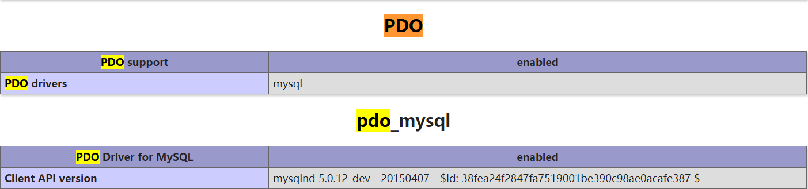

# PDO

> 学习目标：学习别人写好的类的使用，掌握PDO类对数据库的操作，并且能够基于PDO进行二次封装来实现更快捷的项目开发

* PDO扩展
* PDO操作
* PDO异常
* 封装PDO


> 概念

PDO：PHP Data Object，是一种**纯面向对象**的数据库操作扩展

* PDO在PHP5以后的版本增加，是目前通用的PHP操作数据库的扩展
* PDO能够支持多种数据库操作，不限定数据库产品类型
* PDO是一种纯面向对象的操作，有三个类
  * PDO类：初始化和SQL执行
  * PDOStatement类：结果解析
  * PDOException类：异常处理


> 小结

1、PDO是当前PHP操作数据库的通用扩展，所有新的项目目前都会首选PDO来操作数据库


## **一、 PDO扩展**

> 目标：掌握PDO扩展的加载


> 概念

**PDO扩展**：PDO提供了一套帮助用户实现多数据库操作的统一接口，属于扩展加载

* 通过使用PDO，开发人员不需要额外自定义数据库对应的操作类，从而简化开发过程


> 示例

1、PDO在PHP5以前，是需要手动加载扩展的，在php.ini配置文件中，会有这么一个扩展（在PHP5以后就自动加载了不需要手动再加载）

```PHP
;extension = pdo				#现在php.ini中找不到该配置项了
```

2、PDO是一种针对多种数据库的扩展，那就意味着PDO很庞大，所以为了保证PHP运行的效率（系统会自动在开始时加载扩展），默认并没有开启对数据库产品的对应扩展，因此还需要在php.ini中开启目前项目所需要的PDO对应数据库产品的支持

```PHP
;extension=pdo_firebird
;extension=pdo_mysql			#绝大部分项目使用的，只要去掉注释重启Apache即可
;extension=pdo_oci
;extension=pdo_odbc
;extension=pdo_pgsql
;extension=pdo_sqlite
```

3、加载PDO对mysql数据库产品的扩展，重启Apache，然后通过phpinfo()函数就可以查看PDO的加载情况了，至少有两个加载才算成功：PDO本身和PDO针对的数据库产品




> 小结

1、PDO是一种外部提供的扩展，PHP如果想直接调用，需要加载扩展

2、PDO因为支持产品很多，所以分解成了PDO支持扩展和PDO对应数据库产品的支持，PDO扩展在PHP5以后自动开启，而数据库产品的支持需要开发者根据实际项目所有数据库来选择性开启


## **二、 PDO操作**

> 学习目录：掌握使用系统类的方式，掌握PDO类和PDOStatement类的基本操作，实现数据库的增删改查

* PDO手册查阅
* PDO类基本应用
* PDO写操作
* PDO查询操作
* PDO事务功能
* PDO预处理


### **1、PDO手册查阅**

> 目标：掌握系统的类的使用方法，学会API文档的使用


> 概念

**手册查阅**：是指对于已经添加到PHP系统内的工具的使用查询

* 通过翻阅手册，可以快速的了解一些工具或者扩展的功能和使用方式
* 通过翻阅手册，可以获取一些别人提供解决方案


> 示例

1、查询方式1：进入到操作手册，然后打开目录列表：**函数参考**->**数据库扩展**->**数据库抽象层**->**PDO**


**注意**：该方式能够方便且有序的看到一个工具或者扩展的所用功能和使用方式（初学者建议）

2、查询方式2：直接在操作手册进入`索引`，然后在里面输入PDO


**注意**：该方式能够快速定位到查询的具体元素，需要大家在有一定了解的情况下才能完成（系统是按顺序匹配），在明确自己想要了解具体功能后，可以使用该方式

3、系统类使用方式：一般是了解对象的生成方式，以及各项功能的调用方式和具体效果


4、系统类使用方式：除开知道怎么用之外，一定还要去了解返回结果和`意外状况`


5、当我们了解了一个工具的基本功能后，就可以找到入口开始对其学习和使用了。例如PDO中有三个类，每个类负责不同的功能需求。我们只要掌握彼此间的功能和练习，就可以使用PDO来实现数据库操作


> 小结

1、任何一种系统支持，包括工具和扩展，都可以通过操作手册来学习和应用

2、PDO属于一种数据库扩展，可以在**函数参考**下对应的**数据库扩展**下找到

3、扩展学习应该是目的性的，了解有哪些功能以及如何使用某个功能

4、PDO有三个类需要学习


### **2、PDO类基本应用**

> 目标：快速了解PDO类的基本功能，能够利用PDO类实现数据库的初始化认证和SQL执行


> 概念

**PDO类基本应用**：了解PDO类的方法，使用PDO方法解决相应需求问题

* PDO类虽然提供了很多方法，但是常用的方法有以下几个
  * PDO::__construct()：实例化PDO对象：帮助实现连接认证、数据库选择、字符集设置
  * PDO::exec()：执行一个写操作SQL指令，返回受影响的行数
  * PDO::query()：执行一个读操作SQL指令，返回一个PDOStatement类对象（后者进行数据解析操作）
  * PDO::errorCode()和PDO::errorInfo()：获取上次错误的信息（错误码和错误描述数组）

* PDO实例化对象：利用其构造方法__construct(string \$dsn,string ​\$user,string \$pass[,array ​\$drivers])实现，构造方法由4个参数组成，其中一般前三个为必须参数，第四个为可选参数
  * $dsn：一个数据库基本信息字符串，包含数据库产品，主机地址等
    * 驱动名字（数据库产品），使用英文`:`分隔，如mysql:表示使用mysql数据库
    * 驱动选项（主机地址），使用host=具体主机地址，跟在驱动名字之后，如'mysql:host=localhost'
    * 驱动选项（端口），使用port=端口号，默认为3306可以不写，拼凑在驱动名字后，不区分先后顺序。如'mysql:host=localhost;port=3306'或者'mysql:port=3306;host=localhost'，使用分号和其他驱动分开
    * 驱动选项（数据库名字），使用dbname=数据库名字（可以事先没有）
    * 字符集设置（字符集名字）使用charset=字符集名字（可以事先没有）
  * \$user：用户名，如果数据库允许匿名用户出现，那么可以没有该参数（只有$dsn）
  * $pass：密码，与用户名一样
  * $drivers：PDO属性设置，是关联数组，利用PDO内部的常量进行设置


> 步骤

1、实例化PDO对象，完成数据库初始化认证

2、根据SQL类型选择不同的方法执行SQL

3、检查SQL可能存在的语法错误


> 示例

1、实例化PDO对象，完成初始化操作

```PHP
# 方案1：直接写入数据进行数据库初始化
$pdo = new PDO('mysql:host=localhost;port=3306;dbname=db_2;charset=utf8','root','root');

# 方案2：利用变量保存数据来实现数据库初始化（数据来源可以是其他配置文件：安全）
$dsn = 'mysql:host=localhost;dbname=db_2;charset=utf8';
$user = 'root';
$pass = 'root';
$pdo = new PDO($dsn,$user,$pass);
```

2、得到对象后，我们就可以利用PDO对象调用相关方法执行SQL操作：exec执行数据返回SQL，query执行有结果返回SQL

```PHP
# 实例化PDO对象
$pdo = new PDO('mysql:host=localhost;port=3306;dbname=db_2','root','root');

# 写操作
$sql = "delete from t_28";		# 模拟SQL指令
$rows = $pdo->exec($sql);		# 得到受影响的行数：执行失败返回false

# 读操作
$sql = "select * from t_40";
$stmt = $pdo->query($sql);		# 成功返回PDOStatement类对象，失败得到false
```

3、如果PDO对象在执行SQL时出现错误，即SQL本身有错误，那么可以通过PDO类提供的errorCode()和errorInfo()

```PHP
# 实例化PDO对象
$pdo = new PDO('mysql:host=localhost;port=3306;dbname=db_2','root','root');

# 写操作
$sql = "delete fromt_40";		# 错误SQL
$rows = $pdo->exec($sql);

# 错误判定：exec方法执行结果成功也存在返回0的情况，错误会返回false，所以要判定是否是SQL错误，需要判定结果为false
if(false === $rows){
    # 取出错误细信息
    echo 'SQL错误：<br/>';
    echo '错误代码为：' . $pdo->errorCode() . '<br/>';
    echo '错误原因为：' . $pdo->errorInfo()[2];			
    # errorInfo返回数组，2下标代表错误具体信息
    exit;		
    # 错误不需要继续执行代码
}
```


> 小结

1、PDO是一种外部提供的扩展，可以通过操作手册来协助学习使用

2、PDO类主要用来实现数据库的初始化操作和SQL指令的执行

3、 SQL执行的结果不论是写操作还是读操作都有可能出错，因此需要进行错误处理


### **3、PDO写操作**

> 目标：利用PDO类完成一个完整的写操作实现


> 概念

**写操作**：即利用PDO实现数据库增删改操作

* 操作过程中要考虑到SQL本身可能出现的错误处理，以及对结果的操作处理
* 很多代码的执行都需要进行错误检查，可以对代码进行封装处理


> 步骤

1、初始化连接资源

2、组织SQL并执行

3、检查SQL执行结果，判定语法错误

4、返回受影响的行数（必要时返回自增长ID）


> 示例

1、初始化PDO，每次操作都需要用到PDO实例化：封装执行

```PHP
# 初始化PDO：增加错误抑制符，一致在初始化过程可能出现的错误（信息不对连接不上）
function pdo_init(){
    $pdo = @new PDO('mysql:host=localhost;port=3306;dbname=db_2;charset=utf8','root','root');
    if(!$pdo){
        exit('数据库连接认证失败！');
    }
    
    # 返回得到的PDO对象
    return $pdo;
}

```

2、SQL通常应该是外部传入，外部需要的只是结果，不考虑过程，所以在实际开发时要考虑二次封装。即外部传入SQL，内部执行并控制错误，最终返回结果

```PHP
# 封装执行：函数封装需要传入PDO对象（也可以在函数内部实例化对象）
function pdo_exec($pdo,$sql){
    # 调用PDO对象的方法执行写SQL
    $res = $pdo->exec($sql);
    # 错误判定
	if(false === $res){
        # 取出错误细信息：实际开发是将错误信息记录到系统日志中，返回false
        echo 'SQL错误：<br/>';
        echo '错误代码为：' . $pdo->errorCode() . '<br/>';
        echo '错误原因为：' . $pdo->errorInfo()[2];			
        exit;
	}
    
    # 返回执行结果：受影响的行数（直接是受影响的行数）
    return $res;
}
```

3、具体实现写操作

```PHP
# 引入文件：封装的PDO文件
include 'pdo.php';			# 假设所有封装都放到了pdo.php中
# 初始化
$pdo = pdo_init();
# 组织要执行的SQL
$sql = 'delete from t_29';
$res = pdo_exec($pdo,$sql);
# 结果使用
echo '本次操作共实现数据库操作：' . $res . '条记录！';
```

**注意**：一般写操作都是受影响行数，但是如果是插入操作，有时候需要新增记录的自增长ID，可以通过PDO::lastInsertId()来获取

```PHP
# 接上述代码
$id = $pdo->lastInsertId();	# 实际开发也应封装
echo '新增成功！新增的ID为：' . $id;
```


> 小结

1、实际使用PDO的时候，都会进行二次封装，因为PDO的操作有很多本身不够完善

2、PDO类可以独立完成写操作功能，而不需要使用其他两个工具类

3、PDO的写操作其实本质要注意的是执行SQL时可能出现的错误处理

4、写操作中唯一不同的是插入操作，因为可能需要获取自增长ID，此时需要多一个步骤（功能）


### **4、PDO查询操作**

> 目标：掌握PDO对查询操作的实现，理解类中产生其他类对象的原理，实现数据库的查询操作


> 概念

**查询操作**：通过执行SQL指令后从数据库获得相应的数据，然后对数据加工变成PHP可识别的格式

* PDO::query()方法只能执行SQL，并不能直接解析结果，返回一个PDOStatement类对象
* PDOStatement::fetch()系列方法从对象中实现数据获取
  * fetch：获取一条记录
  * fetchAll：获取全部记录

* FETCH_STYLE：通过常量设计的方式实现获取数据的不同效果


> 步骤

1、初始化数据库连接

2、组织SQL指令并通过PDO::query()执行

3、检查可能出现的SQL语法错误

4、通过PDOStatement类按照具体需求实现数据解析


> 示例

1、查询是建立在连接之上，因此需要使用到前面封装的初始化功能

```PHP
function pdo_init(){
    $pdo = @new PDO('mysql:host=localhost;port=3306;dbname=db_2','root','root');
    if(!$pdo){
        exit('数据库连接认证失败！');
    }
    
    # 返回得到的PDO对象
    return $pdo;
}
```

2、查询的SQL也是可能出现问题的部分，因此同样需要进行错误检查：另外PDO查询使用的是PDO::query()方法实现

```PHP
function pdo_query($pdo,$sql){
    # 调用PDO对象的方法执行读SQL
    $stmt = $pdo->query($sql);
    # 错误判定
	if(false === $stmt){
        # 取出错误细信息
        echo 'SQL错误：<br/>';
        echo '错误代码为：' . $pdo->errorCode() . '<br/>';
        echo '错误原因为：' . $pdo->errorInfo()[2];			
        exit;
	}
    
    # 返回执行结果：PDOStatement类对象
    return $stmt;
}
```

3、此时查询出来的结果是一个对象，不能提供任何PHP可访问的数据结果，还需要对结果进行处理。而我们查询数据的时候通常是两种操作：根据具体条件获取一条记录或者多条记录，因此返回的数据是不同的。解决方案也有多种方式：

* ①创建多个函数来实现不同效果
* ②创建一个函数，但是通过参数来控制实现不同效果

```PHP
function pdo_get($stmt,$only = true){
    # $stmt是PDO查询得到的对象，$only代表默认只获取一条记录
    
    # 安全判定
    if(!$stmt instanceof PDOStatement) return false;
    
    # PDOStatement类中提供了两种方法分别去获取一条和多条记录
    # 判定条件
    if($only){
        # 获取一条记录PDOStatement::fetch()：返回一维数组
        return $stmt->fetch();
    }else{
        # 获取多条记录PDOStatement::fetchAll()：返回二维数组，一个维度代表一条记录
        return $stmt->fetchAll();
    }
}
```

4、此时从功能上来讲，只要顺序调用以上几个方法即可完成

```PHP
$pdo = pdo_init();			# 初始化
# 查询
$sql = 'select * from t_40 where 条件';
$stmt = pdo_query($pdo,$sql);
# 获取一条记录
$row = pdo_get($stmt);
# 获取多条记录
$rows = pdo_get($stmt,false);
```

5、fetch系列方法默认返回的数据是重复的：数据的索引方式和关联方式各出现一次，而实际在进行开发数据展示时通常是通过数据表字段名字作为下标进行数据查看，所以此时可以通过设定fetch系列的条件fetch_style来实现


可以根据系统提供的方式来修改pdo_get函数，在后面再增加一个默认参数即可

```PHP
function pdo_get($stmt,$only = true,$fetch_style = PDO::FETCH_ASSOC){
    # fetch_style默认使用关联数组返回

    # 判定条件
    if($only){
        # 获取一条记录PDOStatement::fetch()：返回一维数组
        return $stmt->fetch($fetch_style);
    }else{
        # 获取多条记录PDOStatement::fetchAll()：返回二维数组，一个维度代表一条记录
        return $stmt->fetchAll($fetch_style);
    }
}
```


> 小结

1、查询操作是通过PDO::query()执行查询SQL得到PDOStatement对象，然后PDOStatement对象下有一系列fetch方法可以实现数据查询，得到PHP可以识别的数组数据

2、PDO实现查询通常也需要进行二次封装，保证SQL执行安全，也方便用户获取目标数据


### **5、PDO事务功能**

> 目标：掌握PDO对于MySQL事务的封装，能够利用PDO实现事务操作需求


> 概念

**PDO事务功能**：并非PDO额外多出了一项功能，而是将原来MySQL所支持的事务操作进行了一定的封装实现

* 事务执行是否成功是由MySQL对应的存储引擎（InnoDB支持）是否支持决定的
* PDO只是对具体的操作步骤进行了封装而已
  * PDO::beginTransaction()：开启事务
  * PDO::exec()：执行事务（写操作）
  * PDO::rollBack()：回滚所有事务
  * PDO::commit()：成功提交所有事务


> 步骤

1、初始化数据库操作

2、开启事务

3、执行事务

4、根据结果选择对事务操作的处理


> 示例

1、事务操作的基本实现

```PHP
# 实例化PDO对象
$pdo = new PDO('mysql:host=localhost;port=3306;dbname=db_2;charset=utf8','root','root');

# 开启事务
$pdo->beginTransaction() or die('事务开启失败');

/*
	# PDO类内部
	public function beginTransaction(){
		$sql = 'start transaction';
		
		# 写方法执行
		$res = $this->exec($sql);
		
		# 判定结果
		if($res === false) return false;
		
		return true;
	}
*/

# 执行事务
$pdo->exec('insert into t_40 values()');
# 连续操作

# 终止事务：判定结果
$pdo->commit();				# 成功提交
$pdo->rollback();			# 失败回滚
```

2、在事务操作中，有一种回滚点机制，在PDO中没有实现，如果有必要，可以通过SQL指令设置来实现

```PHP
# 实例化PDO对象
$pdo = new PDO('mysql:host=localhost;port=3306;dbname=db_2','root','root');

# 开启事务
$pdo->beginTransaction() or die('事务开启失败');

# 执行事务
$pdo->exec('insert into t_40 values()');

# 设置回滚点
$pdo->exec('savepoint sp1');
/*
	# 封装设置回滚点的函数
	function savepoint($pdo,$name){
		$sql = "savepoint {$name}";
		
		# 执行
		$res = $pdo->exec($sql);
		
		# 判定结果
		return $res ==== false ? false : true;
	}
*/

# 继续执行事务...

# 回滚
$pdo->exec('rollback to sp1');

# 终止事务
$pdo->commit();				# 成功提交
$pdo->rollback();			# 失败回滚
```


> 小结

1、事务的本质是由既定SQL指令完成，而事务具体操作内容一定是外部指定的SQL（写操作）来处理

2、PDO提供了事务固定内容的封装，包括开启事务（PDO::beginTransaction()）和事务终止（PDO::commit()和PDO::rollback()）

3、回滚点可以通过PDO::exec()方法来设定和回滚

4、如果不采用PDO的事务机制，也可以完全利用PDO::exec()来实现

* PDO::exec('start transaction')：开启事务
* PDO::exec('commit')：提交事务
* PDO::exec('rollback')：回滚事务


### **6、PDO预处理**

> 目标：掌握PDO对于MySQL预处理的支持，能够利用PDO实现预处理操作


> 概念

**PDO预处理**：是PDO封装一套特定的方法，在方法中做了一些优化操作，使得开发人员可以便捷的用来实现预处理

* PDO预处理的实现是基于MySQL预处理机制，只是针对预处理的操作过程进行了内部封装
  * 参数处理：可以使用原占位符`?`，也可以使用PDO占位符`:名字`

* PDO中预处理提供了一套方法机制，主要由以下几个方法组成
  * PDO::prepare()：发送预处理指令，只需要提供要执行的指令即可，不需要prepare 名字 from。成功得到一个PDOStatement类对象，失败得到一个false（或者异常错误）
  * PDOStatement::bindParam()：绑定预处理所需要的参数，只能绑定变量（引用传递）
  * PDOStatement::bindValue()：绑定预处理所需要的参数，可以绑定值（值传递）
  * PDOStatement::execute()：执行预处理，成功返回true，失败返回false


> 示例

1、PDO发送预处理指令：即利用PDO::prepare()方法将要执行的SQL指令先发送给服务器编译

```PHP
# 实例化PDO对象
$drivers = array(
    PDO::ATTR_ERRMODE => PDO::ERRMODE_EXCEPTION
);
$pdo = new PDO('mysql:host=localhost;port=3306;dbname=db_2','root','root',$drivers);


# 发送预处理指令
$pre_sql = "select * from t_40";				# 无数据预处理指令
$pre_sql = "select * from t_40 where id = ?";	# 有参数预处理指令
$pre_sql = "select * from t_40 where id = :id";	# PDO特定预处理参数指令（: + 字符串），更明确

# 执行最后一条预处理指令：即使用:id作为参数的
$stmt = $pdo->prepare($pre_sql);
if(!$stmt) die('预处理指令执行失败！');
```

2、绑定预处理参数：如果预处理本身是需要携带参数的，那么可以使用PDOStatement::bindValue()/bindParam()进行参数绑定

**PDOStatement::bandValue()**

```PHP
# 接上述代码
$stmt->bindValue(':id',1);			# 直接绑定数值
$id = 2;
$stmt->bindValue(':id',$id);		# 绑定变量数据
```

**注意**：如果在发送预处理指令的时候，使用的是“?”作为占位符，那么我们在进行绑定数据的时候，是按照顺序进行绑定的，起始位置的占位符序号为1，如果有多个占位符，依次类推

```PHP
# 预处理指令：select * from t_40 where id = ?
$stmt->bindValue(1,$id);
```


**PDOStatement::bindParam()**

```PHP
# 接预处理指令
# $stmt->bindParam(':id',3);		# 错误：不能绑定值，引用传递，只能是变量
$id = 4;
$stmt->bindParam(':id',$id);		# 必须是传递变量	
```

4、执行预处理：利用PDOStatement::execute()方法

```PHP
# 接上述代码
$res = $stmt->execute();
if(!$res) die('预处理执行失败！');

# 如果是查询，想要得到预处理执行的结果，还需要使用PDOStatement::fetch()方法进行数据解析
$row = $stmt->fetch(PDO::FETCH_ASSOC);
```


> 小结

1、PDO预处理除了本身实现了MySQL的预处理，还额外优化了占位符：使用: + 名字作为占位符（查看更清晰）

2、PDO利用了PDO::prepare()方法发送预处理SQL指令，成功得到PDOStatement对象

3、PDO利用PDOStatement::bindValue()/bindParam()来实现预处理数据绑定

4、PDO利用PDOStatement::execute()来实现调用预处理

5、如果利用PDO预处理来实现数据查询，那么在执行完成预处理之后，还需要调用PDOStatement::fetch()方法获取预处理得到的数据


### **7、PDO预处理数据绑定**

> 目标：掌握PDO关于预处理参数绑定的实现，掌握不同类型数据绑定的实际区别


> 概念

**数据绑定**：是指在进行预处理指令定义时使用了占位符，为了保证后续执行预处理时能够正确执行，将实际数据替换占位符的过程

* 数据绑定的方式应该与占位符方式对应
* PDOStatement::execute()方法本身就可以实现数据传递和绑定
* PDOStatement::bindValue()和bindParam()在实际运用中有明显区别


> 示例

1、在PDO中，execute本身是可以直接进行数据绑定的，即在参数中增加对应的占位符数据，以数组形式传入

```PHP
# 预处理形式使用原始占位符？
$stmt = $pdo->prepare('select * from t_40 where id = ?');
$stmt->execute(array(10));		# array代表是数组，10代表是替换值，如果有多个元素，顺序放入即可

# 预处理形式使用PDO占位符：+ 名字
$stmt = $pdo->prepare('select * from t_40 where id = :id');
$stmt->execute(array(':id' => 10));	# 使用占位符作为数组元素下标
```

2、PDOStatement::bindValue()和PDOStatement::bindParam()区别

- 二者都可以实现占位符的数据绑定
- bindValue()绑定数据的方式灵活，可以是变量也可以是数据常量；而bindParam()只能是变量
- 因为bindParam绑定的是变量（引用传值），所以如果被绑定的变量发生改变，会直接影响后续execute结果

```PHP
$stmt = $pdo->prepare('select * from t_40 where id = :id');

$id = 1;
$stmt->bindValue(':id',$id);
for(;$id < 10;$id++){
    $stmt->execute();
    $row = $stmt->fetch(PDO::FETCH_ASSOC);
}
# 上述所有结果$row都是s_id为1的数据

$id = 1;
$stmt->bindParam(':id',$id);
for(;$id < 10;$id++){
    $stmt->execute();
    $row = $stmt->fetch(PDO::FETCH_ASSOC);
}
# 上述所有结果$row是s_id从1-9的数据
```


> 小结

1、PDO绑定预处理数据的方式有多重：PDOStatement::bindValue()/bindParam()/execute()

2、如果数据简单且不需要重复，那么使用bindValue()/execute()都可以

3、如果数据本身是变化的，而且是有规则（数组遍历出来的结果），那么可以使用bindParam()来节省操作


## **三、 PDO异常**

> 学习目标：理解异常的概念，掌握异常处理的方式，掌握PDO中异常的实际应用

* 异常机制
* PDO错误机制
* PDOException异常处理


### **1、异常机制**

> 目标：了解异常概念，掌握异常的实现模式


> 概念

**异常机制**：Exception，是面向对象中一种错误捕捉机制

* 用来捕捉一些执行层面的问题（语法问题会在编译时就出现，开发可以避免）

* 通常是因为一些不确定的内容导致代码无法正常运行，然后我们可以按照设定的逻辑来处理这些问题

* 异常机制允许开发者主动处理错误，而不是被动的处理错误

* 异常机制是面向对象语言中一种程度的处理错误的方式

* PHP提供了一套成熟的异常处理机制：Exception类

  * PHP默认的是警告模式：即出错后立即报错给用户
  * PHP想要使用异常机制：需要触发异常机制（set_error_handler(回调函数)）

* 异常处理语法

  * 捕获异常

  ```php
  try{
      # 可能出现异常的代码
  }catch(Exception 异常对象){
      # 主动处理异常（错误信息在异常对象中）
  }
  ```

  * 主动抛出异常

  ```php
  # 根据逻辑判定主动终止代码执行
  throw new Exception();		# 不同的异常可以有不同的类
  ```

  * 处理异常：在catch中主动处理异常，优雅的给用户提示结果


> 步骤

1、确定使用异常进行错误处理：设置异常处理解决方案

2、确定异常可能出现的种类，明确要使用的异常类

3、明确有可能出现错误的代码：使用try将代码块包裹

* 必要时在里面主动抛出异常

4、捕获异常处理异常，在catch中获取抛出的异常对象

* 在catch内部进行错误处理


> 示例

1、明确可能出现错误的代码。如：

```PHP
$res = 4 / 0;
```

* 上述代码在编译时不存在问题，但是在运行的时候因为被除数为0，所以会出现错误。而这个时候默认的，就是系统无法正确执行，立马给出错误（PHP默认的规则）。这种错误直接给出的方式不属于异常捕捉，异常捕捉需要用到异常类Exception类进行捕捉：使用throw 

```PHP
# 外部传入数据：不确定
$n1 = 10;
$n2 = 5;
# 要求$n1 / $n2
if($n2 == 0){
    # 被除数为0，不能操作：抛出异常
    throw new Exception('被除数不能为0！');
}

# 没有问题继续执行
$res = $n1 / $n2;
```

* 很明显，使用面向对象的方式会额外增加代码来实现错误处理。但是在面向对象中，异常机制通常很成熟，并不需要写额外很多的代码，而且绝大部分时间里，我们并不会去处理“不可能”出现问题的代码。

2、可以将代码块放到一个会自动捕获错误的代码块中来实现异常的处理。异常捕捉语法如下：

```PHP
# 正常不会出错代码
echo 'hello world';
$n1 = $_GET['n1'];
$n2 = $_GET['n2'];

# 可能出现异常代码：使用try{}进行包裹捕捉
try{
    # 代码的执行具有未知性：但是代码没有语法错误
    $res = $n1 / $n2;					# 产生错误就会产生一个Exception类对象，捕获错误
}catch(Exception $e){
    # 捕获后的处理代码：如果try中没有问题，不会进入到catch内部
    # $e中保存了$res = $n1 / $n2;会出现的错误
    die('出错了...');
}
```

3、以上代码在PHP中运行即便出错也不会执行，原因是系统默认使用的警告模式，即有任何问题都是直接报错。如果要实现异常处理，必须借助于系统提供的set_error_handler(回调函数)来告知系统我们想采用的处理模式

```PHP
set_error_handler(function (){
    throw new Exception('错误！');
});
```

```PHP
# 上述方式等价于先定义函数后注册
function exception_handler(){
    throw new Exception('错误');
}
set_error_handler('exception_handler');
```

4、有了上述代码在错误处理之前，那么系统碰到错误，就会调用我们定义的function来进行错误处理：处理也分两种模式：有try和没有try

```PHP
# 接上述代码：没有try
$res = 5 / 0;
# 错误：直接报错，但是实际上已经调用了自定义错误处理函数，只是异常没有处理，系统处理了

# 有try：try和catch不分家
try{
    $res = 5 / 0;
}catch(Exception $e){
    die('错误：被除数不能为0')；
}
```

5、异常对象$e到目前为止没有产生任何作用，其实Exception类中有很多的方法和属性，可以帮助我们统一获取错误信息的


具体使用如下

```PHP
try{
    # 可能出现问题的代码块
}catch(Exception $e){
    echo '代码运行错误！<br/>';
    echo '错误文件为：' . $e->getFile() . '<br/>';
    echo '错误行号为：' . $e->getLine() . '<br/>';
    echo '错误描述为：' . $e->getMessage();
    die();
}
```

6、有的时候代码如果走到了一个“死胡同”，即代码执行没有任何问题，但是不符合我们的逻辑。以前我们是跳转提示，现在可以抛出异常，交给异常来处理：throw new Exception();

```PHP
try{
    if($n != 0){
        $res = 10 / $n;
    }else{
        # 业务没法发展了，直接抛出异常
        throw new Exception('被除数不能为0！');
    }
}catch(Exception $e){
    echo '代码运行错误！<br/>';
    echo '错误文件为：' . $e->getFile() . '<br/>';
    echo '错误行号为：' . $e->getLine() . '<br/>';
    echo '错误描述为：' . $e->getMessage();
    die();
}
```


> 小结

1、异常是面向对象中处理错误的一种方式，能够让整体用一种统一的方式对外处理错误

2、异常机制是利用try{}catch(Exception $e){}来进行捕捉和处理的，Exception类提供了很多方法可以方便获取各种错误相关信息

3、PHP默认是警告模式（还有静默模式和异常模式），即直接系统给出错误，如果想使用异常处理，那么就需要设置错误异常模式set_error_handler(异常回调函数)来实现

4、异常模式中，必须使用try{}catch(){}才会捕捉异常，否则只会系统提示（如果因为异常处理代码太麻烦，可以将异常处理代码封装成函数或者类来实现代码简化


### **2、PDO错误机制**

> 目标：了解PDO中的错误机制，理解不同机制的不同效果


> 概念

**PDO错误机制**：指PDO在使用过程中出现了错误（大多是SQL指令执行错误）的时候，PDO处理错误的方式。

* PDO中提供了三种错误机制，是通过PDO的常量PDO::ATTR_ERRMODE来选择的
  * PDO::ERRMODE_SILENT：静默模式，出错了不处理（默认的）
  * PDO::ERRMODE_WARNING：警告模式，出错了立马给出错误提示
  * PDO::ERRMODE_EXCEPTION：异常模式，出错了将错误交给异常PDOException对象


> 示例

1、PDO::ERRMODE_SILENT静默模式

```PHP
$pdo = new PDO('mysql:host=localhost;port=3306;dbname=db_2','root','root');
$pdo->exec('insert into t_40 values()');		# 错误：但是不会报错
```

2、PDO::ERRMODE_WARNING警告模式

```PHP
$pdo = new PDO('mysql:host=localhost;port=3306;dbname=db_2','root','root');
# 设定处理模式为警告模式
$pdo->setAttribute(PDO::ATTR_ERRMODE,PDO::ERRMODE_WARNING);
$pdo->exec('insert into t_40 values()');		# 错误：系统直接报错
```

3、PDO::ERRMODE_EXCEPTION异常模式

```PHP
$pdo = new PDO('mysql:host=localhost;port=3306;dbname=db_2','root','root');
$pdo->setAttribute(PDO::ATTR_ERRMODE,PDO::ERRMODE_EXCEPTION);
try{
    $pdo->exec('insert into t_40 values()');	# 错误：被捕捉到
}catch(PDOException $e){
    # 进入到异常处理
}
```


> 小结

1、PDO提供了多种错误处理机制：静默模式、警告模式和异常模式，默认是静默模式

2、PDO可以通过PDO::setAttribute()方法来设定错误处理模式


### **3、PDOException异常处理**

> 目标：掌握PDO中异常的实际使用，能够用PDO异常机制来封装代码处理异常


> 概念

**PDOException**：是PDO从Exception继承的一个用于处理PDO错误的异常类

* 一般如果做一套扩展，都会从去继承Exception类来实现一套明确的错误机制（错误来自哪里）

* 要使用PDOException异常处理，需要设定PDO的错误模式为**异常模式**
* 在PDO中可以通过两种模式来实现异常模式的设定
  * 在初始化PDO对象的时候，利用第四个参数来设定
  * 在初始化PDO之后，利用PDO::setAttribute()方法来修改错误模式


> 步骤

1、确定使用PDO异常来处理错误

2、设定错误模式为异常模式

3、在可能出现错误的地方捕捉异常，使用PDOException类捕捉


> 示例

1、设定异常模式：利用PDO::__construct()的第四个参数实现或者在实例化PDO之后利用PDO::setAttribute()方法设置（必须在可能出错前先设置，否则前面出错的代码不会被异常捕捉到）

```PHP
# 1.初始化PDO时设定错误模式
$drivers = array(
	# 可以设置多种驱动（属性设置）
    PDO::ATTR_ERRMODE => PDO::ERRMODE_EXCEPTION
);
$pdo = new PDO('mysql:host=localhost;port=3306;dbname=db_2','root','root',$drivers);

# 2.使用属性设置
$pdo = new PDO('mysql:host=localhost;port=3306;dbname=db_2','root','root');
$pdo->setAttribute(PDO::ATTR_ERRMODE,PDO::ERRMODE_EXCEPTION);
```

2、当确定了我们要使用异常模式处理之后，我们就可以针对可能出错的位置使用异常来进行捕捉了（通常是进行SQL执行的时候）

```PHP
$drivers = array(
    PDO::ATTR_ERRMODE => PDO::ERRMODE_EXCEPTION
);
$pdo = new PDO('mysql:host=localhost;port=3306;dbname=db_2','root','root',$drivers);

# 执行SQL
try{
    $pdo->exec('set names utf-8');		# 错误
}catch(PDOException $e){
    echo 'SQL执行错误！<br/>';
    echo '错误文件为：' . $e->getFile() . '<br/>';
    echo '错误行号为：' . $e->getLine() . '<br/>';
    echo '错误描述为：' . $e->getMessage();
    die();
}
```

3、从PDO执行来讲，因为PDO异常模式的设置是在PDO实例化之后，那么如果PDO实例化的时候错误，此时好像PDOException就无法工作了。事实上，PDO也考虑到了这点，所以PDO实例化的时候，本身是可以使用try{}catch(){}来捕获的

```PHP
$drivers = array(
    PDO::ATTR_ERRMODE => PDO::ERRMODE_EXCEPTION
);
# 实例化PDO
try{
	$pdo = new PDO('mysql:host=localhost;port=3306;dbname=db_2','root','root',$drivers);
}catch(PDOException $e){
    echo '数据库连接失败！<br/>';
    echo '错误文件为：' . $e->getFile() . '<br/>';
    echo '错误行号为：' . $e->getLine() . '<br/>';
    echo '错误描述为：' . iconv('gbk','utf-8',$e->getMessage());
    die();
}
```

4、PDO执行过程中，如果碰到了意外（逻辑无法继续执行），那么也可以主动抛出异常

```PHP
$drivers = array(
    PDO::ATTR_ERRMODE => PDO::ERRMODE_EXCEPTION
);

# 实例化PDO
try{
	$pdo = new PDO('mysql:host=localhost;port=3306;dbname=db_2','root','root',$drivers);
}catch(PDOException $e){
    echo '数据库连接失败！<br/>';
    echo '错误文件为：' . $e->getFile() . '<br/>';
    echo '错误行号为：' . $e->getLine() . '<br/>';
    echo '错误描述为：' . $e->getMessage();
    die();
}

# 抓异常
try{
    $pdo->exec('insert into t_40 values');
    $id = $pdo->lastInsertID();
    if(!$id) throw new PDOException('没有拿到自增长ID：插入失败');
}catch(PDOException $e){
    echo 'SQL执行失败！<br/>';
    echo '错误文件为：' . $e->getFile() . '<br/>';
    echo '错误行号为：' . $e->getLine() . '<br/>';
    echo '错误描述为：' . $e->getMessage();
    die();
}
```


> 小结

1、PDOException是一种用来捕获异常PDO（PDOStatement）类使用过程中产生的错误的

2、PDOException在使用之前需要开启PDO的异常模式（PDO的实例化除外，可以直接捕捉）

3、因为要处理的异常通常类似，都是一些与用户相关的操作，所以可以也应该对这种处理进行封装处理（独立出来）

4、PDOException一般是在SQL执行过程中出错，如果其他代码执行过程中，业务逻辑不符合要求（代码没问题），那么也可以使用throw new PDOException()来实现抛出异常


## **四、 封装PDO【掌握】**

> 目标：理解外部或者系统类的优缺点，思考自己开发时要如何使用，对已有类可以进行二次封装


> 概念

**封装PDO**:即对PDO进行二次封装，从而让原本多处需要使用PDO的地方，能够直接使用二次封装的类，简化数据库操作

* PDO类要使用的话每次都需要进行初始化操作，而且不够灵活
* PDO类要进行某些操作的时候，需要进行较多步骤实现
* PDO类默认不是异常处理


> 步骤

1、明确PDO需要封装的内容

- PDO的实例化：得到PDO对象，而且PDO对象需要在不同的方法中使用，可以考虑将PDO得到的对象保存在属性中
- 写操作：包含普通SQL执行返回受影响行和获取自增长ID
- 查操作：包含单行查询和多行查询
- 隐藏操作：异常处理的封装
- 其他操作：根据实际需求增加对应功能即可

2、使用命名空间方便使用


> 示例

1、增加命名空间：并引入系统类（系统类不能自动跨全局空间进入到子空间）

```PHP
# 命名空间：因为PDO通常属于核心类（项目中几乎每次都会访问数据库），使用核心关键字core命名
namespace core;
# 有了命名空间，所以PDO的三个类就不再直接使用，需要使用完全限定名称访问，为了方便，可以事先引入元素
use \PDO,\PDOStatement,\PDOException;
```

2、定义类：增加必要属性（PDO对象）

```PHP
class MyPDO{
    # 属性
    private $pdo;
    private $fetch_mode;
    public $error;
}
```

3、增加初始化方法：得到PDO对象：考虑参数的外部传入和默认值，数据较多可以采用关联数组（异常处理）

```PHP
# 构造方法
# 默认采用PDO异常和获取关联数组设定
public function __construct($database_info = array(),$drivers = array()){
    # 如果要考虑细致，可以看看是否存在
    $type = $database_info['type'] ?? 'mysql';		# 默认mysql数据库
    $host = $database_info['host'] ?? 'localhost';
    $port = $database_info['port'] ?? '3306';
    $user = $database_info['user'] ?? 'root';
    $pass = $database_info['pass'] ?? 'root';
    $dbname = $database_info['dbname'] ?? 'db_2';
    $charset = $database_info['charset'] ?? 'utf8';
    
    # fetchmode不能在初始化的时候实现，需要在得到PDOStatement类对象好设置
    $this->fetch_mode = $dirvers[PDO::ATTR_DEFAULT_FETCH_MODE] ?? PDO::FETCH_ASSOC;
    
    # 控制属性
    if(!isset($dirvers[PDO::ATTR_ERRMODE]))
        $dirvers[PDO::ATTR_ERRMODE] = PDO::ERRMODE_EXCEPTION;
    
    # 连接认证
    try{
        # 增加错误抑制符防止意外
        $this->pdo = @new PDO($type . ':host=' . $host . ';port=' . $port . ';dbname=' . $dbname . ';charset=' . $charset,$user,$pass,$drivers);
    }catch(PDOException $e){
        # 属性记录错误
        $this->error['file'] = $e->getFile();
        $this->error['line'] = $e->getLine();
        $this->error['error']= $e->getMessage();
    
        # 返回false，让外部处理
        return false;
    }   
}
```

4、发现异常会经常用到，因此可以将异常封装到方法，从而到处调用（对内调用）

```PHP
# 异常处理方法
private function my_exception(PDOException $e){
    $this->error['file'] = $e->getFile();
    $this->error['line'] = $e->getLine();
    $this->error['error']= $e->getMessage();
    return false;
}
```

**注意**：此时就可以调整构造方法中关于初始化PDO对象的异常处理部分为异常方法

5、增加写SQL操作方法：对外调用

```PHP
# 写操作
public function my_exec($sql){
    try{
        # 调用执行：成功返回，错误捕捉
        return $this->pdo->exec($sql);
    }catch(PDOException $e){
        return $this->my_exception($e);
    }
}
```

6、完善写操作：增加对外提供自增长id方法

```PHP
# 获取自增长ID
public function my_last_insert_id(){
    return $this->pdo->lastInsertId();
}
```

7、增加读方法：对外调用

```PHP
# 读方法：按条件进行单行或者多行数据返回
public function my_query($sql,$only = true){
    try{
        $stmt = $this->pdo->query($sql);
        # 设置查询模式
        $stmt->setFetchMode($this->fetch_mode);
           
    }catch(PDOException $e){
        return $this->my_exception($e);
    }
    
    # 数据解析
    if($only)
        return $stmt->fetch();
    else
        return $stmt->fetchAll();
}
```


> 小结


1、PDO的使用是经常性的，所以我们需要将PDO变得更加灵活，更加贴近我们的项目，从而实现更多代码的复用，因此需要对PDO进行二次封装

2、PDO的封装是要根据项目需求来实现的，如果只是基础功能，那么实现了增删改查即可；而如果项目里要用到更多的内容，如事务、预处理之类的，那么就需要进行更多的封装

3、封装好的PDO类，我们可以更加方便的去实现我们的业务需求（实例化以及调用具体方法即可，后续学习还有办法实现更简单的调用）